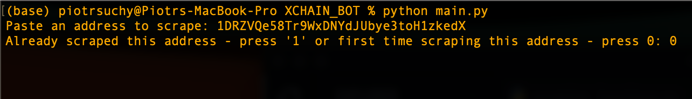
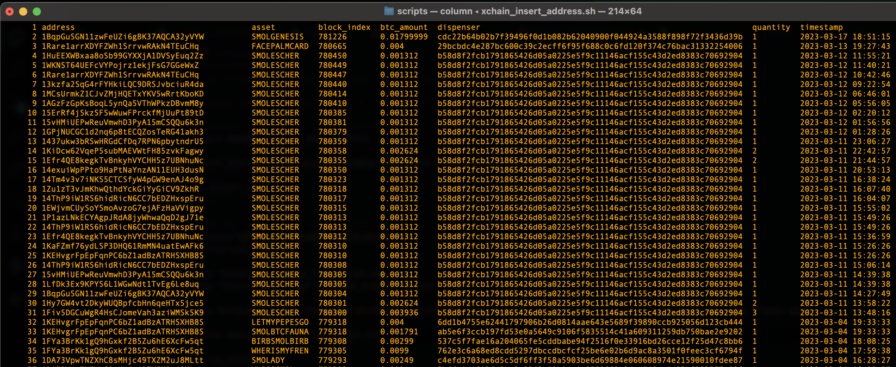
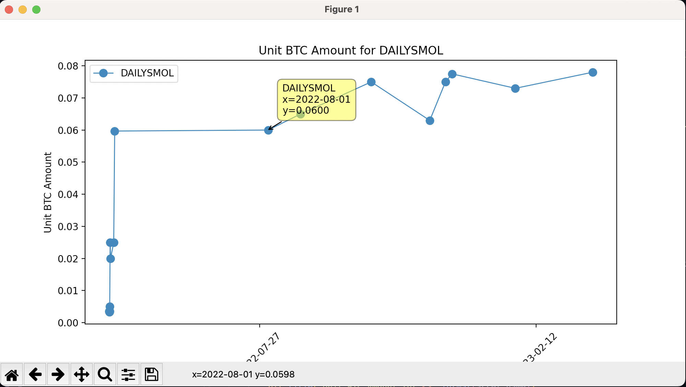

# Project Description

## Update

This project is being rewritten in Go in my free time so check the go_xchain branch if you're interested. Work has only just started but I'm curious to see how it will handle parsing and having no numpy :).

This project is a simple terminal app (with some bash scripts) that based on input will give you information from the [xchain.io](https://xchain.io) blockchain - Counterparty Blockchain (XCP token). As someone who used that blockchain and website I've found the tools to find certain information not sufficient so I decided to code something up to remedy it.

I've focused on dispenses from a certain address. By entering the address you will get a .csv file that contains most of the interesting information (will be customizable in the future) about the dispense. Some more work is needed to clean the data and perhaps visualise the trends for specific assets, but at the very least the program is working. I recommend using the scripts in /scripts folder for the best experience. Second command below might be necessary to change the permissions right after downloading from the repo. This sets the execute permission bit (x) for the owner (u - skip this if you want to set the execute permission for all users) of the file. Run them by:

```bash
cd scripts/
chmod u+x xchain_insert_address.sh
./xchain_insert_address
```

## Example

### For input



### We get the following output after running the script



As you can see we get the information about dispenses in a nice format (actually a .csv file).

## Visualise

I also added a module that lets you plot data about a specific asset. That includes BTC amount paid for an asset and the time of the dispense. There is some stuff to fix with the visualisation, but for now it looks as follows:


## TODO

- counting of aggregates like total price, mean price etc. of created assets by the address
- fix sometimes disappearing dispenses
- formatting of csv and cursor options for visualise

## Useful links to get more information about the blockchain and XCP

- [xchain.io - blockchain main page](https://xchain.io/)
- [blockchain.com - bitcoin chain explorer](https://www.blockchain.com/explorer)
